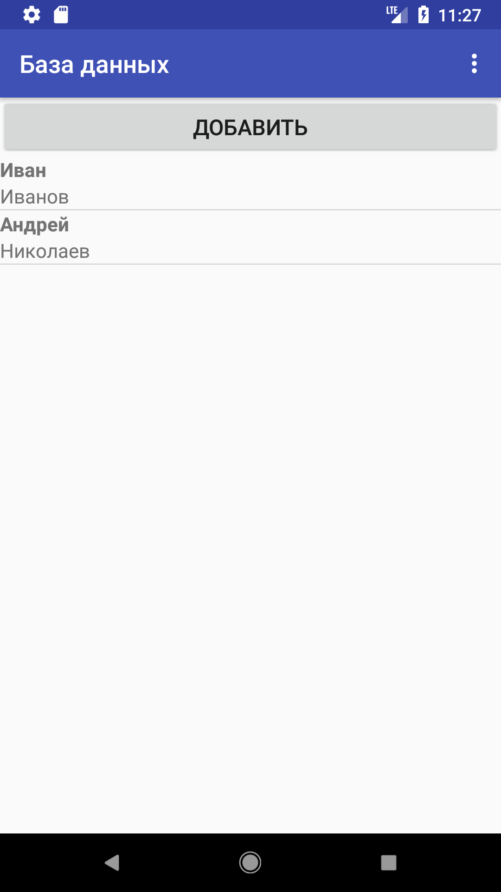
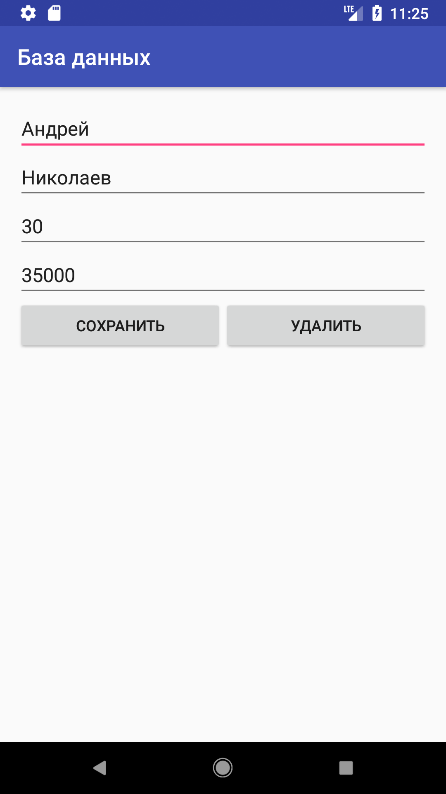
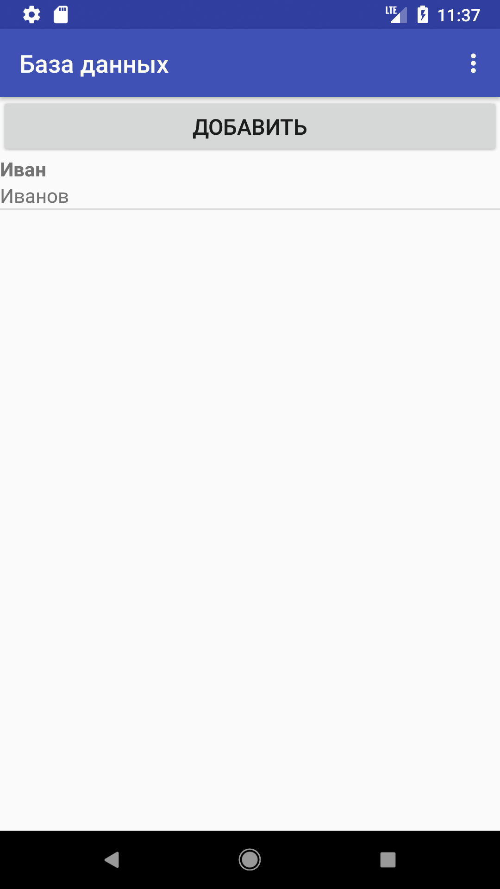

`Перейти на главную страницу`_.

.. _Перейти на главную страницу: index.html

Удаление данных
=================

Для удаления данных необходимо перейти на нужную таблицу и нажать на запись, которую нужно удалить. Например, для изменения сотрудника нужно выбрать таблицу "Сотрудники", затем нажать на запись с именем и фамилией. После этого появится форма редактирования данных сотрудника с возможностью его удалить.

	Рис.1 Список сотрудников

На форме присутствует 4 поля ввода и кнопка удалить. Нужно нажать на кнопку "Удалить".

	Рис.2 Форма редактирования сотрудника c кнопкой "Удалить"

После нажатия на кнопку появится список всех записей, с обновленными данными, где уже не будет удаленного сотрудника.

	Рис.3 Сотрудник удален

`Перейти на главную страницу`_.
